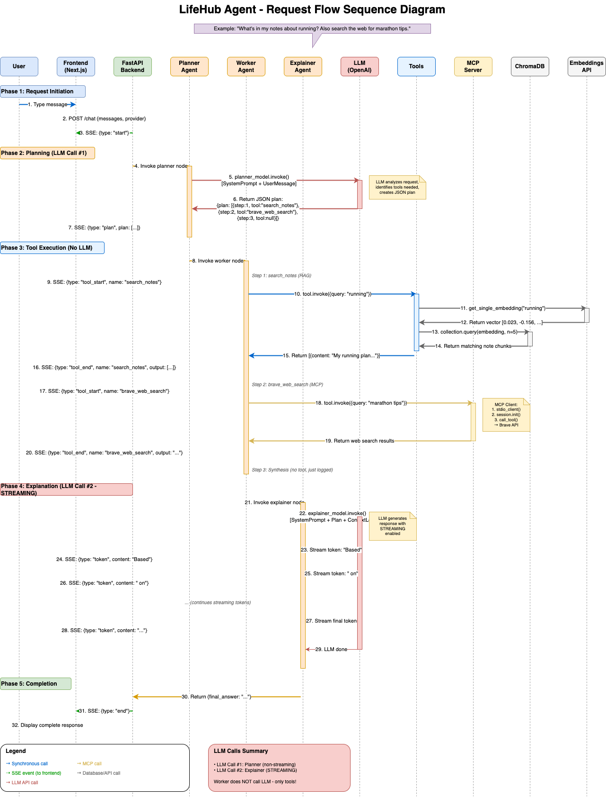

# LifeHub Agent

An AI-powered personal assistant demonstrating modern LLM application architecture with **multi-agent orchestration**, **RAG (Retrieval-Augmented Generation)**, **tool calling**, and **streaming responses**.


---

## 🎯 Overview

LifeHub Agent is a full-stack AI application that showcases how to build production-ready LLM applications. It features:

- **Multi-Agent Architecture**: Planner → Worker → Explainer pipeline
- **RAG System**: Search personal notes using vector embeddings
- **Tool Calling**: Weather lookup, task management, notes search
- **Streaming**: Real-time token streaming via Server-Sent Events (SSE)
- **Provider Flexibility**: Switch between OpenAI and Ollama (local)

<div style="page-break-after: always;"></div>

## 🏗️ Architecture Diagram


<div style="page-break-after: always;"></div>

## 🔄 Request Flow Diagram


<div style="page-break-after: always;"></div>

## 📊 Sequence Diagram

Detailed sequence diagram showing all back-and-forth calls between entities during an end-to-end request lifecycle, including when data is sent to the LLM.



**Key insight**: LLM is called exactly **2 times** per request:
1. **Planner** (non-streaming) → Creates JSON execution plan
2. **Explainer** (streaming) → Generates final user response

The Worker agent does **not** call the LLM - it directly invokes tools and collects results.

<div style="page-break-after: always;"></div>

## 🧠 AI Concepts

This project demonstrates several key AI/LLM concepts:

| Concept | Description |
|---------|-------------|
| **LLMs** | OpenAI GPT-4o-mini or Ollama (Llama 3.2) for local inference |
| **Multi-Agent** | Planner → Worker → Explainer pipeline |
| **RAG** | Vector search over personal notes using ChromaDB |
| **Tool Calling** | Weather, tasks, notes search, web search (MCP) |
| **Streaming** | Real-time token delivery via SSE |
| **MCP** | Model Context Protocol for external tool integration |

> **📖 For detailed explanations with diagrams and code examples, see [AI Concepts Guide](docs/AI_CONCEPTS.md)**

<div style="page-break-after: always;"></div>

## 📁 Project Structure

```
lifehub-agent/
├── backend/
│   ├── app/
│   │   └── main.py              # FastAPI app, /chat & /chat/sync endpoints
│   ├── agents/
│   │   ├── graph.py             # Multi-agent LangGraph (Planner→Worker→Explainer)
│   │   └── graph_legacy.py      # Original single-agent implementation
│   ├── tools/
│   │   ├── weather.py           # get_weather tool
│   │   ├── tasks.py             # add_task tool
│   │   └── notes.py             # search_notes RAG tool
│   ├── rag/
│   │   ├── store.py             # ChromaDB vector store setup
│   │   ├── embeddings.py        # Embedding provider (OpenAI/Ollama)
│   │   └── ingest_notes.py      # Notes ingestion script
│   ├── notes/                   # Markdown notes for RAG
│   │   ├── fitness_example.md
│   │   └── recipes_example.md
│   ├── state/                   # Persistent storage
│   │   ├── tasks.json           # Task list
│   │   └── chroma/              # ChromaDB vector database
│   └── models.py                # LLM client factory (OpenAI/Ollama)
├── frontend/
│   ├── src/
│   │   ├── app/
│   │   │   ├── page.tsx         # Main chat UI
│   │   │   ├── layout.tsx       # App layout
│   │   │   └── globals.css      # Tailwind styles
│   │   └── config.ts            # Backend URL config
│   ├── vercel.json              # Vercel deployment config
│   └── package.json
├── render.yaml                  # Render deployment config
├── requirements.txt             # Python dependencies
├── pyproject.toml               # Project config (uv)
├── DEPLOY.md                    # Deployment instructions
└── README.md                    # This file
```

<div style="page-break-after: always;"></div>

## 🚀 Quick Start

> **📖 For detailed installation instructions (macOS & Windows), see the [Setup Guide](docs/SETUP_GUIDE.md)**

### Prerequisites

- Python 3.11+
- Node.js 18+
- [uv](https://github.com/astral-sh/uv) package manager
- OpenAI API key (or Ollama for fully local setup)

### Backend (Terminal 1)

```bash
cd lifehub-agent
uv sync                                           # Install dependencies
export OPENAI_API_KEY="your-key"                  # Set API key (macOS/Linux)
uv run python -m backend.rag.ingest_notes         # Ingest notes into vector store
uv run uvicorn backend.app.main:app --reload --port 8000  # Start server
```

### Frontend (Terminal 2)

```bash
cd lifehub-agent/frontend
npm install
npm run dev
```

### Open the App

Go to **http://localhost:3000**

### Fully Local with Ollama (No API Key)

```bash
ollama pull llama3.2 && ollama pull nomic-embed-text  # Pull models
EMBEDDING_PROVIDER=ollama uv run python -m backend.rag.ingest_notes
uv run uvicorn backend.app.main:app --reload --port 8000
# Select "Ollama" in the UI dropdown
```

<div style="page-break-after: always;"></div>

## 🔌 API Endpoints

| Endpoint | Method | Description |
|----------|--------|-------------|
| `/health` | GET | Health check |
| `/chat` | POST | Streaming chat (SSE) |
| `/chat/sync` | POST | Non-streaming chat with debug option |

### Example: Streaming Chat
```bash
curl -N -X POST http://localhost:8000/chat \
  -H "Content-Type: application/json" \
  -d '{"messages": [{"role": "user", "content": "What is the weather in Tokyo?"}], "provider": "openai"}'
```

### Example: Debug Mode
```bash
curl -X POST http://localhost:8000/chat/sync \
  -H "Content-Type: application/json" \
  -d '{"messages": [{"role": "user", "content": "Search my notes for fitness info"}], "provider": "openai", "debug": true}'
```

<div style="page-break-after: always;"></div>

## 🌐 Deployment

| Component | Platform | URL |
|-----------|----------|-----|
| Backend | Render | `https://your-app.onrender.com` |
| Frontend | Vercel | `https://your-app.vercel.app` |

See [DEPLOY.md](./DEPLOY.md) for detailed deployment instructions.

---

## 🛠️ Tech Stack

| Layer | Technology |
|-------|------------|
| **LLM Framework** | LangGraph, LangChain |
| **LLM Providers** | OpenAI GPT-4o-mini, Ollama (Llama 3.2) |
| **Vector Store** | ChromaDB (embedded, file-based) |
| **Embeddings** | OpenAI text-embedding-3-small or Ollama nomic-embed-text |
| **Weather API** | Open-Meteo (free, no API key) |
| **MCP Integration** | Model Context Protocol for external tools |
| **Backend** | FastAPI, Python 3.11, httpx, mcp |
| **Frontend** | Next.js, React, TypeScript, Tailwind CSS |
| **Deployment** | Render (backend), Vercel (frontend) |

---

## ⚙️ Environment Variables

| Variable | Required | Default | Description |
|----------|----------|---------|-------------|
| `OPENAI_API_KEY` | Yes* | - | OpenAI API key (*not needed if using Ollama for everything) |
| `EMBEDDING_PROVIDER` | No | `openai` | Embedding provider: `openai` or `ollama` |
| `OLLAMA_BASE_URL` | No | `http://localhost:11434` | Ollama server URL |
| `BRAVE_API_KEY` | No | - | Brave Search API key (enables web search via MCP) |
| `NEXT_PUBLIC_BACKEND_URL` | No | `http://localhost:8000` | Backend URL for frontend |

---

## 🔌 MCP (Model Context Protocol)

LifeHub supports [MCP](https://modelcontextprotocol.io/) for connecting to external tool servers.

### Brave Search Integration

Enable web search by setting the `BRAVE_API_KEY` environment variable:

1. Get a free API key at [Brave Search API](https://brave.com/search/api/) (2,000 queries/month free)
2. Set the environment variable:
   ```bash
   export BRAVE_API_KEY="your-api-key"
   ```
3. Restart the server - MCP tools will be loaded automatically

**Available tools when enabled:**
- `brave_web_search` - Search the web
- `brave_local_search` - Search for local businesses
- `brave_news_search` - Search news articles
- `brave_image_search` - Search images
- `brave_video_search` - Search videos

**Example query:** "Search the web for the latest Python 3.13 features"

---

## 📚 Key Files Reference

| File | Purpose |
|------|---------|
| `backend/rag/embeddings.py` | Embedding provider abstraction |
| `backend/agents/graph.py` | Multi-agent orchestration logic |
| `backend/tools/notes.py` | RAG search implementation |
| `backend/rag/store.py` | ChromaDB setup |
| `backend/mcp/client.py` | MCP client for external tools |
| `backend/mcp/config.py` | MCP server configuration |
| `backend/app/main.py` | API endpoints + streaming |
| `frontend/src/app/page.tsx` | Chat UI component |

---

## 📄 License

MIT
