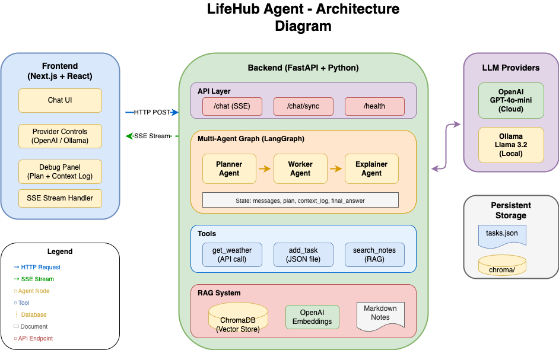
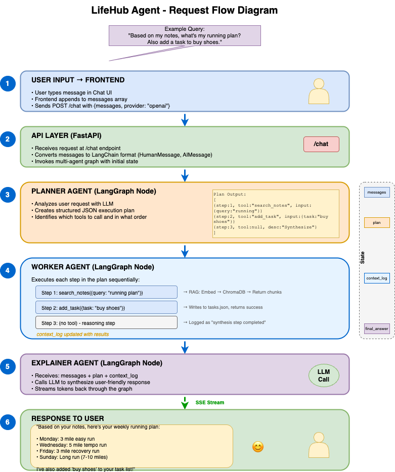

# LifeHub Agent

An AI-powered personal assistant demonstrating modern LLM application architecture with **multi-agent orchestration**, **RAG (Retrieval-Augmented Generation)**, **tool calling**, and **streaming responses**.


---

## 🎯 Overview

LifeHub Agent is a full-stack AI application that showcases how to build production-ready LLM applications. It features:

- **Multi-Agent Architecture**: Planner → Worker → Explainer pipeline
- **RAG System**: Search personal notes using vector embeddings
- **Tool Calling**: Weather lookup, task management, notes search
- **Streaming**: Real-time token streaming via Server-Sent Events (SSE)
- **Provider Flexibility**: Switch between OpenAI and Ollama (local)

<div style="page-break-after: always;"></div>

## 🏗️ Architecture Diagram



<div style="page-break-after: always;"></div>

## 🔄 Request Flow Diagram



<div style="page-break-after: always;"></div>

## 🧠 AI Concepts Explained

### 1. Large Language Models (LLMs)

**What**: Neural networks trained on vast text data to understand and generate human language.

**In this project**:
- **OpenAI GPT-4o-mini**: Cloud-hosted, high-quality responses
- **Ollama (Llama 3.2)**: Local model for privacy/offline use

```python
# backend/models.py
def get_model_client(provider: str = "openai"):
    if provider == "ollama":
        return ChatOpenAI(base_url="http://localhost:11434/v1", model="llama3.2")
    return ChatOpenAI(model="gpt-4o-mini")
```

### 2. Multi-Agent Architecture

**What**: Multiple specialized AI agents working together, each with a specific role.

**In this project**:
```
┌──────────┐     ┌──────────┐     ┌───────────┐
│ PLANNER  │ ──► │  WORKER  │ ──► │ EXPLAINER │
│          │     │          │     │           │
│ Creates  │     │ Executes │     │ Generates │
│ plan     │     │ tools    │     │ response  │
└──────────┘     └──────────┘     └───────────┘
```

- **Planner**: Analyzes request, outputs structured JSON plan
- **Worker**: Executes plan steps, calls tools, logs results
- **Explainer**: Synthesizes everything into user-friendly response

```python
# backend/agents/graph.py
graph.add_edge(START, "planner")
graph.add_edge("planner", "worker")
graph.add_edge("worker", "explainer")
graph.add_edge("explainer", END)
```

### 3. Tool Calling / Function Calling

**What**: LLMs can invoke external functions to perform actions or retrieve data.

**In this project**:
| Tool | Purpose | Implementation |
|------|---------|----------------|
| `get_weather` | Weather lookup | Open-Meteo API (free, no key needed) |
| `add_task` | Task management | Writes to `tasks.json` |
| `search_notes` | RAG search | Queries ChromaDB vector store |

```python
# backend/tools/weather.py - Uses Open-Meteo (free, no API key)
@tool
def get_weather(city: str) -> dict:
    """Get current weather for a city."""
    coords = _get_coordinates(city)  # Geocoding API
    response = httpx.get(WEATHER_URL, params={"latitude": lat, "longitude": lon, ...})
    return {"city": city, "temp": "32°F", "conditions": "clear sky", ...}
```

<div style="page-break-after: always;"></div>

### 4. RAG (Retrieval-Augmented Generation)

**What**: Enhancing LLM responses with relevant information retrieved from a knowledge base.

**In this project**:
```
┌─────────────┐     ┌──────────────┐     ┌──────────────┐
│ User Query  │ ──► │   Embed      │ ──► │  ChromaDB    │
│ "running    │     │   Query      │     │  Similarity  │
│  plan"      │     │  (OpenAI)    │     │   Search     │
└─────────────┘     └──────────────┘     └──────────────┘
                                                │
                                                ▼
                                         ┌──────────────┐
                                         │ Top-K Chunks │
                                         │ from notes   │
                                         └──────────────┘
```

**Components**:
- **Ingestion** (`backend/rag/ingest_notes.py`): Chunks markdown files, embeds with OpenAI or Ollama, stores in ChromaDB
- **Retrieval** (`backend/tools/notes.py`): Embeds query, finds similar chunks
- **Embeddings** (`backend/rag/embeddings.py`): Supports OpenAI or Ollama embedding models
- **Vector Store** (`backend/rag/store.py`): ChromaDB persistent storage (embedded, no external DB needed)

```python
# backend/tools/notes.py
@tool
def search_notes(query: str) -> list[dict]:
    """Search personal notes using semantic similarity."""
    query_embedding = embed_text(query)
    results = collection.query(query_embeddings=[query_embedding], n_results=5)
    return format_results(results)
```

### 5. LangGraph State Machine

**What**: A framework for building stateful, multi-step LLM applications as directed graphs.

**In this project**:
```python
# State flows through the graph
class MultiAgentState(TypedDict):
    messages: list[AnyMessage]      # Conversation history
    plan: list[PlanStep] | None     # Planner output
    context_log: list[ContextLogEntry]  # Worker results
    final_answer: str | None        # Explainer output
```

### 6. Streaming (Server-Sent Events)

**What**: Real-time token-by-token delivery of LLM responses.

**In this project**:
```python
# backend/app/main.py
async def stream_response(messages, provider):
    async for event in agent_graph.astream_events(input, version="v2"):
        if event["event"] == "on_chat_model_stream":
            token = event["data"]["chunk"].content
            yield f"data: {json.dumps({'type': 'token', 'content': token})}\n\n"
```

<div style="page-break-after: always;"></div>

## 📁 Project Structure

```
lifehub-agent/
├── backend/
│   ├── app/
│   │   └── main.py              # FastAPI app, /chat & /chat/sync endpoints
│   ├── agents/
│   │   ├── graph.py             # Multi-agent LangGraph (Planner→Worker→Explainer)
│   │   └── graph_legacy.py      # Original single-agent implementation
│   ├── tools/
│   │   ├── weather.py           # get_weather tool
│   │   ├── tasks.py             # add_task tool
│   │   └── notes.py             # search_notes RAG tool
│   ├── rag/
│   │   ├── store.py             # ChromaDB vector store setup
│   │   ├── embeddings.py        # Embedding provider (OpenAI/Ollama)
│   │   └── ingest_notes.py      # Notes ingestion script
│   ├── notes/                   # Markdown notes for RAG
│   │   ├── fitness_example.md
│   │   └── recipes_example.md
│   ├── state/                   # Persistent storage
│   │   ├── tasks.json           # Task list
│   │   └── chroma/              # ChromaDB vector database
│   └── models.py                # LLM client factory (OpenAI/Ollama)
├── frontend/
│   ├── src/
│   │   ├── app/
│   │   │   ├── page.tsx         # Main chat UI
│   │   │   ├── layout.tsx       # App layout
│   │   │   └── globals.css      # Tailwind styles
│   │   └── config.ts            # Backend URL config
│   ├── vercel.json              # Vercel deployment config
│   └── package.json
├── render.yaml                  # Render deployment config
├── requirements.txt             # Python dependencies
├── pyproject.toml               # Project config (uv)
├── DEPLOY.md                    # Deployment instructions
└── README.md                    # This file
```

<div style="page-break-after: always;"></div>

## 🚀 Quick Start

### Prerequisites

- Python 3.11+
- Node.js 18+
- [uv](https://github.com/astral-sh/uv) package manager
- OpenAI API key (or Ollama for fully local setup)

### Backend Setup (OpenAI)

```bash
cd lifehub-agent

# Install dependencies
uv sync

# Set API key
export OPENAI_API_KEY="your-key"

# Ingest notes into vector store
uv run python -m backend.rag.ingest_notes

# Start server
uv run uvicorn backend.app.main:app --reload --port 8000
```

### Backend Setup (Fully Local with Ollama)

```bash
# Pull required models
ollama pull llama3.2
ollama pull nomic-embed-text

# Use Ollama for embeddings (no OpenAI key needed)
EMBEDDING_PROVIDER=ollama uv run python -m backend.rag.ingest_notes

# Start server
uv run uvicorn backend.app.main:app --reload --port 8000

# Then select "Ollama" in the UI dropdown
```

### Frontend Setup

```bash
cd frontend
npm install
npm run dev
```

Open http://localhost:3000

<div style="page-break-after: always;"></div>

## 🔌 API Endpoints

| Endpoint | Method | Description |
|----------|--------|-------------|
| `/health` | GET | Health check |
| `/chat` | POST | Streaming chat (SSE) |
| `/chat/sync` | POST | Non-streaming chat with debug option |

### Example: Streaming Chat
```bash
curl -N -X POST http://localhost:8000/chat \
  -H "Content-Type: application/json" \
  -d '{"messages": [{"role": "user", "content": "What is the weather in Tokyo?"}], "provider": "openai"}'
```

### Example: Debug Mode
```bash
curl -X POST http://localhost:8000/chat/sync \
  -H "Content-Type: application/json" \
  -d '{"messages": [{"role": "user", "content": "Search my notes for fitness info"}], "provider": "openai", "debug": true}'
```

<div style="page-break-after: always;"></div>

## 🌐 Deployment

| Component | Platform | URL |
|-----------|----------|-----|
| Backend | Render | `https://your-app.onrender.com` |
| Frontend | Vercel | `https://your-app.vercel.app` |

See [DEPLOY.md](./DEPLOY.md) for detailed deployment instructions.

---

## 🛠️ Tech Stack

| Layer | Technology |
|-------|------------|
| **LLM Framework** | LangGraph, LangChain |
| **LLM Providers** | OpenAI GPT-4o-mini, Ollama (Llama 3.2) |
| **Vector Store** | ChromaDB (embedded, file-based) |
| **Embeddings** | OpenAI text-embedding-3-small or Ollama nomic-embed-text |
| **Weather API** | Open-Meteo (free, no API key) |
| **MCP Integration** | Model Context Protocol for external tools |
| **Backend** | FastAPI, Python 3.11, httpx, mcp |
| **Frontend** | Next.js, React, TypeScript, Tailwind CSS |
| **Deployment** | Render (backend), Vercel (frontend) |

---

## ⚙️ Environment Variables

| Variable | Required | Default | Description |
|----------|----------|---------|-------------|
| `OPENAI_API_KEY` | Yes* | - | OpenAI API key (*not needed if using Ollama for everything) |
| `EMBEDDING_PROVIDER` | No | `openai` | Embedding provider: `openai` or `ollama` |
| `OLLAMA_BASE_URL` | No | `http://localhost:11434` | Ollama server URL |
| `BRAVE_API_KEY` | No | - | Brave Search API key (enables web search via MCP) |
| `NEXT_PUBLIC_BACKEND_URL` | No | `http://localhost:8000` | Backend URL for frontend |

---

## 🔌 MCP (Model Context Protocol)

LifeHub supports [MCP](https://modelcontextprotocol.io/) for connecting to external tool servers.

### Brave Search Integration

Enable web search by setting the `BRAVE_API_KEY` environment variable:

1. Get a free API key at [Brave Search API](https://brave.com/search/api/) (2,000 queries/month free)
2. Set the environment variable:
   ```bash
   export BRAVE_API_KEY="your-api-key"
   ```
3. Restart the server - MCP tools will be loaded automatically

**Available tools when enabled:**
- `brave_web_search` - Search the web
- `brave_local_search` - Search for local businesses
- `brave_news_search` - Search news articles
- `brave_image_search` - Search images
- `brave_video_search` - Search videos

**Example query:** "Search the web for the latest Python 3.13 features"

---

## 📚 Key Files Reference

| File | Purpose |
|------|---------|
| `backend/rag/embeddings.py` | Embedding provider abstraction |
| `backend/agents/graph.py` | Multi-agent orchestration logic |
| `backend/tools/notes.py` | RAG search implementation |
| `backend/rag/store.py` | ChromaDB setup |
| `backend/mcp/client.py` | MCP client for external tools |
| `backend/mcp/config.py` | MCP server configuration |
| `backend/app/main.py` | API endpoints + streaming |
| `frontend/src/app/page.tsx` | Chat UI component |

---

## 📄 License

MIT
